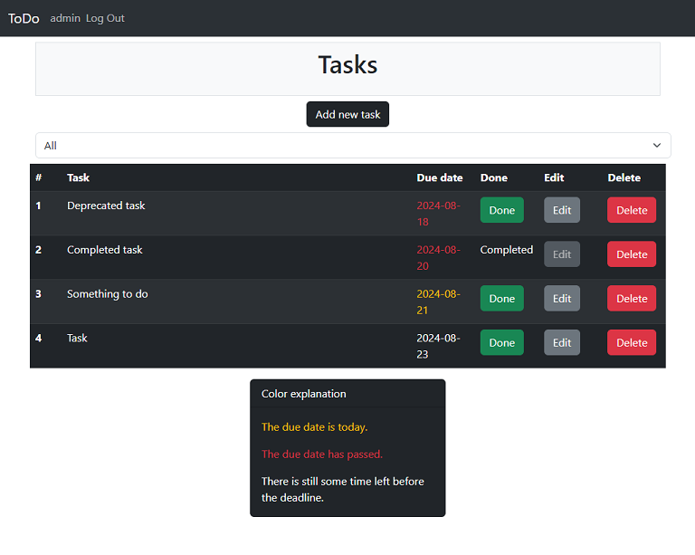

# Flask_todo App

A simple web application to manage your to-do list. The application is built using Flask.



## Features

- Add new tasks
- Set due date
- Mark tasks as completed
- Edit existing tasks
- Delete tasks

## Installation

1. Clone the repository: 
    ```
    git clone https://github.com/tejko23/flask_todo.git
    ```
2. Change directory to the project folder: 
    ```
    cd flask_todo
    ```
3. Create a virtual environment: 
    ```
    python3 -m venv venv
    ```
4. Activate the virtual environment: 
    ```
    . venv/bin/activate
    ```
5. Install the dependencies: 
    ```
    pip3 install -r requirements.txt
    ```
6. Initialize the database: 
    ```
    flask --app todo init-db
    ```
7. Start the application: 
    ```
    flask --app todo run --host=0.0.0.0
    ```

## Testing

* Run tests and generate Coverage report: 
```
python -m pytest
```

## Usage

* Once the application is running, you can access it in your web browser.
* Then you need to register and log in.
* Now you can add, edit, mark as completed and delete your task.